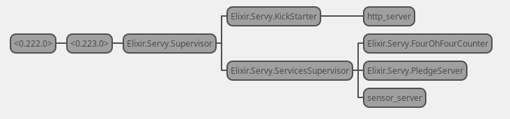

This Elixir app was developed based on what was teached in the [Elixir course from Pragmatic Studio](https://pragmaticstudio.com/elixir).

There is nothing special about the application itslef, but I built it to understand more in depth how Elixir/OTP works and handle generic servers and observers. The picture bellow represents the services structure that is implemented.

To run this app:

  * Install dependencies with `mix deps.get`;
  * Run it with `mix run --no-halt`.
